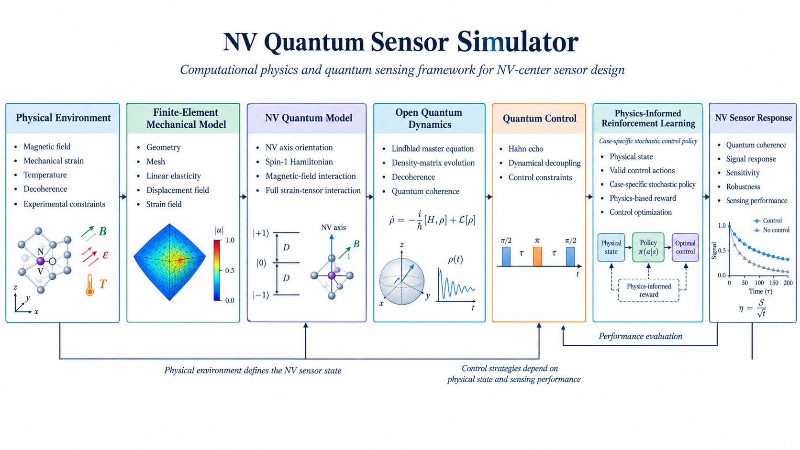
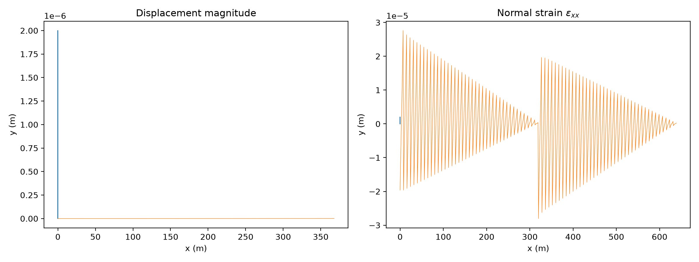
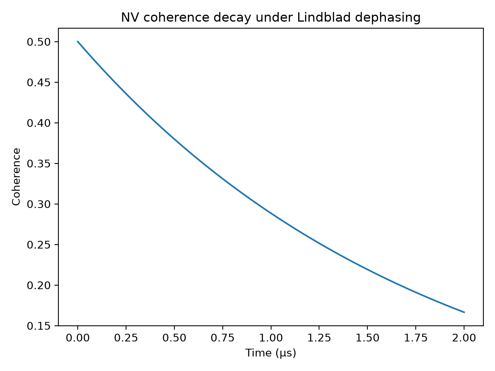

# NV Quantum Sensor Simulator

**A computational framework for designing and testing NV quantum-sensor configurations under realistic physical environments.**

An integrated computational framework connecting finite-element mechanical modeling, NV-center spin dynamics, Lindblad open-system evolution, pulse-sequence simulation, and physics-informed adaptive control.

> **Core objective:** A researcher can computationally design and test an NV quantum-sensor configuration before implementing the corresponding hardware experiment.

---

## **Overview**

Nitrogen-vacancy (NV) centers in diamond provide a powerful platform for quantum sensing of magnetic, mechanical, thermal, and other physical environments.

The performance of an NV quantum sensor depends not only on the intrinsic spin properties of the defect, but also on the local physical environment, sensor geometry, strain distribution, magnetic field, decoherence processes, and available control protocols.

The **NV Quantum Sensor Simulator** provides a computational foundation for studying these coupled effects before experimental implementation.

The project is organized around a modular computational pipeline connecting:

**Physical environment → mechanical fields → NV spin Hamiltonian → Lindblad dynamics → control protocol → quantum response → sensing performance**

The current implementation establishes the core numerical components of this pipeline, while advanced spatially resolved NV modeling, sensing observables, and adaptive physics-informed control are being developed incrementally.

---

## **Computational Workflow**

The simulator connects the physical environment of an NV sensor to its quantum response and sensing performance through an integrated computational workflow.



**Figure 1. End-to-end computational workflow of the NV Quantum Sensor Simulator, including physics-informed control optimization for case-specific sensor conditions.**

The intended computational sequence is:

1. Define the sensor and environmental configuration.
2. Construct the mechanical model using finite-element methods.
3. Compute displacement and strain fields.
4. Map relevant physical quantities into the NV spin model.
5. Construct the NV-center spin Hamiltonian.
6. Propagate the quantum state using Lindblad master-equation dynamics.
7. Apply and simulate dynamical-decoupling or sensing pulse sequences.
8. Evaluate the resulting quantum response and sensing performance.
9. Use adaptive optimization or physics-informed reinforcement learning to identify suitable control configurations for specific physical conditions.

---

## **Current Capabilities**

The current repository provides a computational foundation for:

* NV-center spin-1 Hamiltonian construction.
* Zero-field splitting and Zeeman interactions.
* Effective strain-dependent Hamiltonian terms.
* Lindblad master-equation evolution.
* Pure-dephasing modeling.
* Quantum coherence evaluation.
* Hahn-echo pulse-sequence simulation.
* Finite-element mechanical modeling using `scikit-fem`.
* Mechanical displacement and strain-field calculation.
* Mesh-convergence analysis.
* Coupling of FEM-derived strain information to the NV model.
* Automated numerical and physics-consistency tests.
* Visualization of representative mechanical and quantum-simulation results.

Advanced capabilities, including explicit NV-axis orientation, spatially resolved local environments, full strain-tensor coupling in the NV frame, sensing observables, and adaptive control optimization, form the next stage of development.

---

## **Finite-Element Mechanical Modeling**

The mechanical component uses finite-element methods to calculate displacement and strain fields in a representative sensor environment.

The FEM module is structured to support:

* Geometry definition.
* Mesh generation.
* Elasticity calculations.
* Displacement-field evaluation.
* Strain-field extraction.
* Mesh-convergence studies.
* Transfer of mechanical information to the NV spin model.

### **Finite-Element Mechanical Field**



**Figure 2. Finite-element simulation of the mechanical displacement and strain fields used as the basis for NV strain modeling.**

The mechanical field provides the physical environment from which local strain-dependent effects can be introduced into the quantum model.

---

## **NV Spin Hamiltonian**

The NV electronic ground state is modeled as a spin-1 quantum system.

The Hamiltonian currently includes the principal contributions:

* Zero-field splitting.
* Zeeman interaction with an external magnetic field.
* An effective transverse strain contribution.

The model can be expressed as:

$$
H = H_{\mathrm{ZFS}} + H_{\mathrm{Z}} + H_{\mathrm{strain}}
$$

The implementation uses **QuTiP** for quantum operators and quantum-state evolution.

The Hamiltonian module is intentionally separated from the FEM implementation so that different physical environments and field configurations can be evaluated without restructuring the quantum-dynamics layer.

### **Planned Hamiltonian Extensions**

The next development stage will extend the model toward:

* Explicit NV-axis orientation.
* Local coordinate transformations into the NV reference frame.
* Spatially resolved NV positions.
* Full strain-tensor coupling.
* More physically complete magnetic, strain, and environmental interactions.

These extensions will allow the same physical environment to be evaluated for different NV orientations and spatial configurations.

---

## **Lindblad Quantum Dynamics**

Open-system dynamics are modeled using the Lindblad master equation.

The current implementation supports pure dephasing through a collapse operator and evaluates the evolution of the density matrix using QuTiP.

The general form is:

$$
\frac{d\rho}{dt}
=
-i[H,\rho]
+
\sum_k
\left(
L_k\rho L_k^\dagger
-
\frac{1}{2}
\left\{
L_k^\dagger L_k,\rho
\right\}
\right)
$$

This provides a foundation for studying the effect of environmental decoherence on NV quantum coherence and control protocols.

The framework can later be extended with additional relaxation and environmental channels as the physical model becomes more detailed.

---

## **Pulse Sequences and Dynamical Decoupling**

Quantum sensing performance depends strongly on the applied control sequence.

The current implementation includes a basic **Hahn-echo** protocol and provides a foundation for extending the simulator toward more advanced dynamical-decoupling and sensing sequences.

Potential future protocols include:

* Hahn echo.
* Carr-Purcell-type sequences.
* CPMG.
* XY-family sequences.
* Case-dependent optimized pulse sequences.

The objective is to evaluate how control choices interact with the physical environment and decoherence processes.

---

## **Example Calculations**

### **NV Coherence Decay**

Run the coherence-decay example with:

```bash
python -m examples.coherence_decay
```

This example demonstrates quantum coherence decay under Lindblad dephasing.



**Figure 3. Simulated NV coherence decay under Lindblad dephasing.**

---

### **Finite-Element Visualization**

Run:

```bash
python -m examples.fem_visualization
```

This generates a visualization of the mechanical displacement and strain fields obtained from the finite-element model.

---

### **Mesh Convergence**

Run:

```bash
python -m examples.mesh_convergence
```

The example evaluates the mechanical response for multiple mesh resolutions and provides a basic numerical convergence check.

---

### **FEM-to-NV Coupling**

Run:

```bash
python -m examples.fem_to_nv
```

This example demonstrates the transfer of FEM-derived strain information into the NV strain-coupling model.

---

### **Hahn Echo**

Run:

```bash
python -m examples.hahn_echo
```

This example combines the NV Hamiltonian, Lindblad dephasing, and a Hahn-echo control sequence to evaluate the resulting quantum coherence.

---

## **Researcher Use**

The intended use of the simulator is to allow a researcher to modify a physical sensor configuration and evaluate its consequences computationally before implementing the corresponding experiment.

A typical workflow can include:

1. Define a mechanical or environmental configuration.
2. Generate the corresponding FEM mesh and physical fields.
3. Evaluate displacement and strain distributions.
4. Select an NV position and orientation.
5. Map local physical quantities into the NV coordinate system.
6. Construct the corresponding spin Hamiltonian.
7. Simulate open-system quantum dynamics.
8. Apply a sensing or dynamical-decoupling sequence.
9. Evaluate a sensing-related observable.
10. Compare alternative sensor configurations or control protocols.

The first stages are already represented by the current computational modules. The later stages are part of the continuing development of the simulator.

---

## **Physics-Informed Adaptive Control**

A longer-term objective of the project is to introduce an adaptive control layer that respects the underlying physical structure of the sensing problem.

The control architecture can be represented conceptually as:

$$
s_{\mathrm{NV}}
\rightarrow
\pi_{\theta}(a \mid s_{\mathrm{NV}})
\rightarrow
\text{control configuration}
\rightarrow
\text{quantum evolution}
\rightarrow
\text{sensing response}
$$

where the observed physical state may contain quantities such as:

* Magnetic field.
* Local strain.
* Temperature.
* Decoherence parameters.
* NV orientation.
* Spatial configuration.
* Experimental control constraints.

The control policy can then select an admissible control configuration appropriate for the current physical state.

The objective is not simply to maximize an abstract numerical reward. The optimization should remain constrained by the physical and experimental structure of the sensing system.

A future multi-objective formulation may combine:

* Sensing performance.
* Quantum coherence.
* Robustness.
* Control cost.
* Experimental feasibility.

This layer is currently under development and is intentionally kept separate from the established physics modules.

---

## **Validation and Testing**

The repository includes automated tests covering the main computational components.

The test suite currently checks:

* NV Hamiltonian construction.
* Spin-1 operator consistency.
* Magnetic-field response.
* Lindblad evolution.
* Quantum coherence behavior.
* FEM mesh generation.
* Elasticity calculations.
* Strain-field extraction.
* FEM-to-NV strain coupling.
* Hahn-echo evolution.

Run the complete test suite with:

```bash
pytest
```

The tests provide a reproducible numerical baseline as the physical and control models become more sophisticated.

---

## **Software Stack**

The project is implemented in Python and currently uses:

* **NumPy** — numerical array operations.
* **SciPy** — scientific computing utilities.
* **Matplotlib** — scientific visualization.
* **QuTiP** — quantum dynamics and open-system simulation.
* **scikit-fem** — finite-element modeling.
* **pytest** — automated testing.

---

## **Repository Structure**

```text
nv-quantum-sensor-simulator/
│
├── README.md
├── pyproject.toml
├── .gitignore
│
├── fem/
│   ├── __init__.py
│   ├── geometry.py
│   ├── mesh.py
│   ├── elasticity.py
│   └── strain_field.py
│
├── nv/
│   ├── __init__.py
│   ├── hamiltonian.py
│   ├── lindblad.py
│   ├── strain_coupling.py
│   └── pulse_sequences.py
│
├── pirl/
│   └── __init__.py
│
├── examples/
│   ├── coherence_decay.py
│   ├── fem_visualization.py
│   ├── mesh_convergence.py
│   ├── fem_to_nv.py
│   └── hahn_echo.py
│
├── tests/
│   ├── test_hahn_echo.py
│   ├── test_hamiltonian.py
│   ├── test_lindblad.py
│   ├── test_fem.py
│   └── test_strain_coupling.py
│
├── docs/
│   └── images/
│       ├── schematic_workflow.png
│       ├── fem_fields.png
│       └── coherence_decay.png
│
└── results/
    └── .gitkeep
```

---

## **Development Roadmap**

The project is being developed incrementally from validated physics components toward a complete computational sensor-design framework.

### **Stage 1 — Core Physics Foundation**

* NV spin Hamiltonian.
* Magnetic-field interaction.
* Lindblad quantum dynamics.
* Decoherence modeling.
* FEM elasticity.
* Strain-field extraction.
* FEM-to-NV coupling.
* Basic pulse-sequence simulation.
* Automated numerical tests.

**Status: Implemented foundation.**

### **Stage 2 — Spatially Resolved NV Modeling**

* Explicit NV positions.
* Explicit NV-axis orientations.
* Local-field extraction.
* Coordinate transformations into the NV frame.
* Full strain-tensor coupling.
* More complete physical interaction models.

**Status: Continuing development.**

### **Stage 3 — Sensing Observables**

* Experimentally meaningful sensing observables.
* Signal-response calculations.
* Sensitivity-related metrics.
* Robustness analysis under environmental variation.

**Status: Planned / continuing development.**

### **Stage 4 — Adaptive Quantum Control**

* Control-parameter optimization.
* Dynamical-decoupling optimization.
* Case-specific control strategies.
* Physics-constrained reinforcement learning.
* Robust control under realistic environmental conditions.

**Status: Continuing development.**

### **Stage 5 — Integrated Sensor Design**

The long-term objective is an integrated computational workflow in which researchers can explore sensor configurations and control strategies before committing to hardware implementation.

---

## **Further Development**

Detailed extensions of the computational framework, including advanced sensing observables, explicit NV orientation, full strain-tensor interactions, adaptive control, and physics-informed learning, will be documented separately as the corresponding implementations are completed.

The architecture is intentionally modular so that these capabilities can be introduced without restructuring the existing FEM and quantum-dynamics foundations.

---

## **Related Research and Adaptive Control**

The broader adaptive-control direction is also conceptually informed by previous research on case-dependent execution under predefined structural constraints.

**DynFair: An Ontology-Grounded Reinforcement Learning Framework for Intrinsically Fair Protocol-Compliant Multi-Faceted Decision Execution — Case-Specific Stochastic Policies for Protocol-Compliant Execution**

DynFair studies how a predefined decision can be executed correctly under different observed structural conditions.

In simple terms, the research considers how the execution of a predefined decision can adapt to the requirements of the current case while respecting the valid structural constraints of the system.

This concept can be integrated into the NV sensing context, where the observed physical state defines the current sensor condition and an adaptive control method can determine an appropriate control configuration within the physical and experimental constraints.

The connection is therefore methodological: **the physical model and sensor data describe the current case, while an adaptive learning or optimization layer can determine an appropriate execution strategy for that case.**

This provides a potential bridge between quantum-sensor simulation, sensor data, physics-informed machine learning, and adaptive quantum control.

The source code associated with the DynFair research will be made publicly available upon publication of the corresponding research work. A formal publication reference and link will be added here upon publication.

---

## **Project Status**

This repository is an actively developing computational research project.

The current version establishes the numerical foundations required for coupled mechanical and quantum modeling. Advanced spatial NV modeling, physically complete strain interactions, sensing observables, and adaptive control are being added progressively.

The emphasis is on:

* Physically interpretable models.
* Reproducible numerical simulations.
* Modular scientific software.
* Explicit validation through automated tests.
* Clear separation between implemented functionality and future research extensions.

---

## **License**

This project is intended as an open scientific software project. Licensing details will be finalized as the repository develops.
